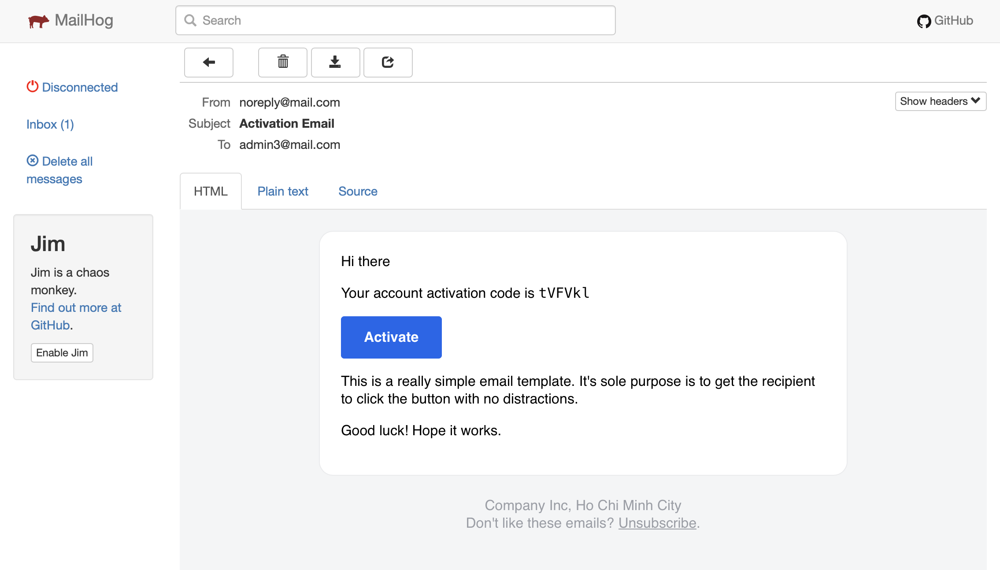
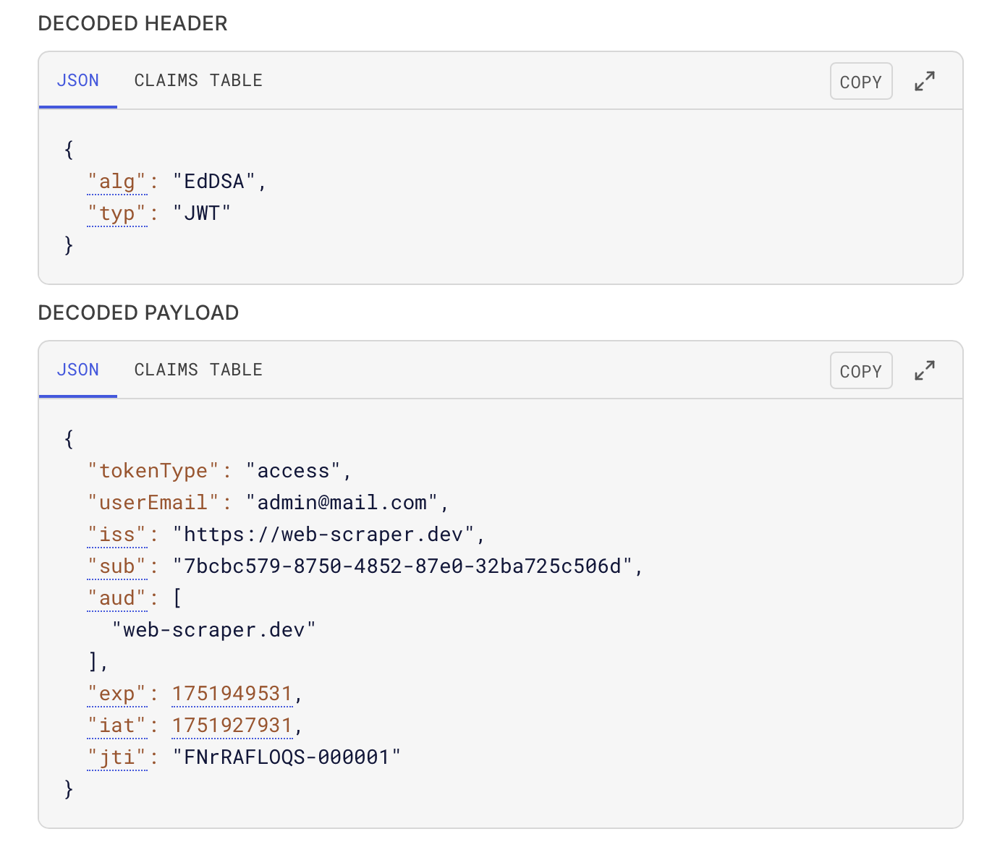

# web-scraper

## Database Design


## Email Design



Credits go to [leemunroe/responsive-html-email-template](https://github.com/leemunroe/responsive-html-email-template)

> MailHog: http://localhost:8025
> Username: `user` Password: `password`

## Ed25519 JWT Signing and Verification Keys



> [Public/ Private PEM keys for access/refresh tokens](internal/utils/jwtutil/assets)
> 
> ```bash
> openssl genpkey -algorithm ed25519 -outform PEM -out access-private-key.pem
> openssl pkey -outform PEM -pubout -in access-private-key.pem -out access-public-key.pem
> ```
