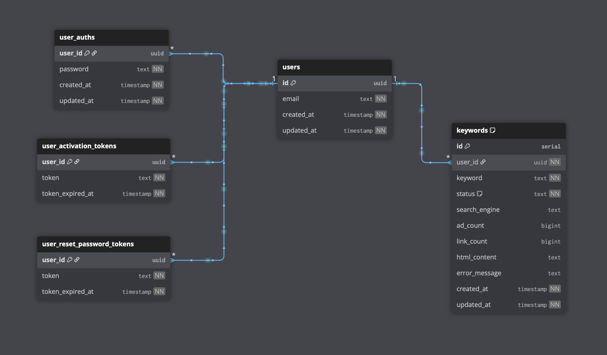

# web-scraper

## Database Design



## Email Design


Credits go to [leemunroe/responsive-html-email-template](https://github.com/leemunroe/responsive-html-email-template)

> MailHog: http://localhost:8025
> Username: `user` Password: `password`

## Ed25519 JWT Signing and Verification Keys


> [Public/ Private PEM keys for access/refresh tokens](internal/utils/jwtutil/assets)
> 
> ```bash
> openssl genpkey -algorithm ed25519 -outform PEM -out access-private-key.pem
> openssl pkey -outform PEM -pubout -in access-private-key.pem -out access-public-key.pem
> ```

## Project Design

```shell
.
├── cmd
│   ├── api
│   │   └── main.go
│   ├── dbmigrate
│   │   └── main.go
│   └── worker
│       └── main.go
├── database
│   └── migrations
│       └── 00001_create_initial_tables.sql
├── internal
│   ├── api
│   │   ├── errors
│   │   ├── handlers
│   │   │   ├── health
│   │   │   │   └── handler.go
│   │   │   ├── keyword
│   │   │   │   └── handler.go
│   │   │   └── user
│   │   │       ├── handler.go
│   │   │       └── handler_model.go
│   │   └── router
│   │       ├── middleware
│   │       │   ├── content_type.go
│   │       │   ├── content_type_test.go
│   │       │   ├── jwt_authentication.go
│   │       │   ├── request_id.go
│   │       │   ├── request_id_test.go
│   │       │   └── requestlog
│   │       │       ├── handler.go
│   │       │       └── log_entry.go
│   │       └── router.go
│   ├── config
│   │   └── config.go
│   ├── mailer
│   │   ├── conf.go
│   │   ├── mailer.go
│   │   ├── mailer_activation_email.go
│   │   └── tmpl
│   │       └── activation-email.html
│   ├── model
│   │   ├── keyword.go
│   │   ├── model.go
│   │   ├── token.go
│   │   ├── user.go
│   │   ├── user_activation_token.go
│   │   └── user_auth.go
│   ├── repository
│   │   ├── db.go
│   │   ├── keyword.go
│   │   ├── user.go
│   │   └── user_activation_token.go
│   ├── tasks
│   │   └── scrape.go
│   ├── utils
│   │   ├── ctxutil
│   │   │   ├── ctx_user.go
│   │   │   └── ctxutil.go
│   │   ├── jwtutil
│   │   │   ├── claims.go
│   │   │   ├── jwtutil.go
│   │   │   └── tokens.go
│   │   ├── logger
│   │   │   ├── logger.go
│   │   │   └── logger_test.go
│   │   └── validator
│   │       └── validator.go
│   └── workers
│       └── scrapeworker.go
├── LICENSE
├── mailhog.auth
├── openapi-v3.1.0.yml
├── compose.yml
├── Dockerfile
├── go.mod
├── go.sum
├── file.csv
└── README.md
```

## Screenshots

> 💡 Whole website support light/ dark themes.

- Sign up


- Activation Code


- Dashboard


- Keywords


- Upload


- Dark mode


- Logs


